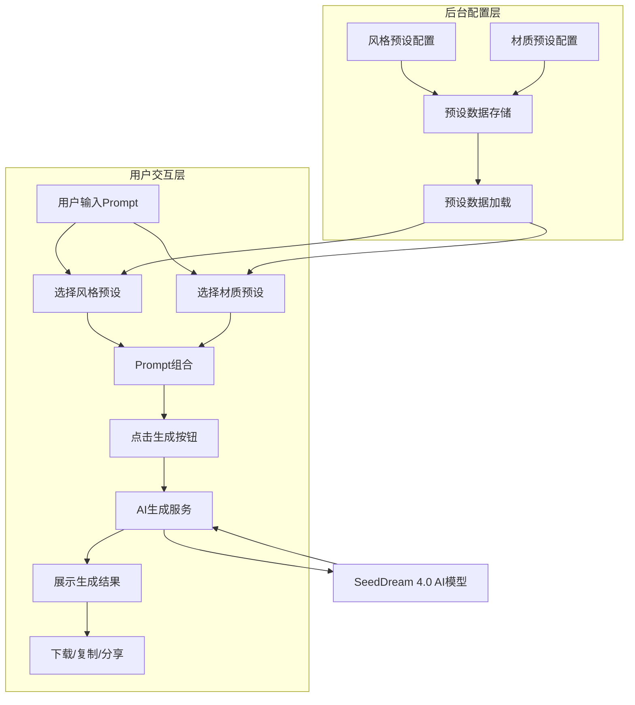
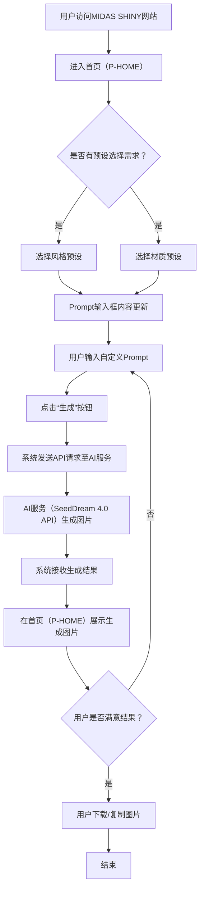
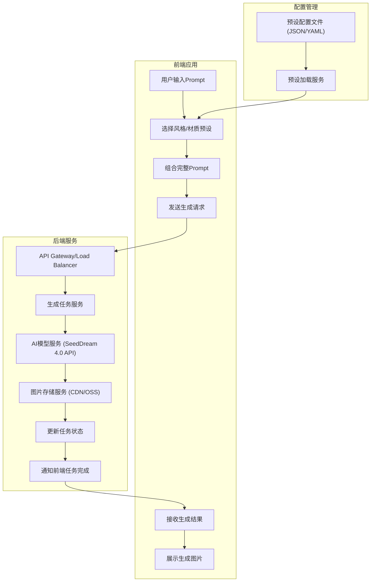

# MIDAS SHINY 产品需求文档

## 1. 产品概述

### 1.1 产品名称与定位

*   **产品名称:** MIDAS SHINY
*   **产品定位:** 一款面向潮玩设计师、艺术创作者、玩具收藏家和普通消费者的Web端AI潮玩设计生成工具。通过AI技术，帮助用户快速将创意转化为潮玩设计图，降低设计门槛，提升设计效率。

### 1.2 产品应用语言

*   **产品应用语言:** 简体中文

### 1.3 产品愿景与目标

*   **产品愿景:** 成为潮玩设计领域最具创新性和易用性的AI辅助工具，激发无限创意，赋能潮玩产业。
*   **产品目标:**
    *   提供高效、直观的AI潮玩设计生成体验。
    *   降低潮玩设计的专业门槛，让更多人能够参与潮玩创作。
    *   通过预设风格和材质，丰富潮玩设计的多样性。
    *   建立稳定可靠的AI生成服务，确保生成结果的质量和效率。

### 1.4 产品使用终端

*   **主要终端:** Web端桌面应用
*   **浏览器支持:** Chrome 90+、Firefox 88+、Safari 14+、Edge 90+
*   **分辨率支持:** 768x480及以上分辨率，最佳体验为1920x1080
*   **响应式适配:** 支持768px以上的所有桌面和平板设备。

### 1.5 核心价值主张

*   **AI驱动的创意生成:** 利用先进的AI模型（SeedDream 4.0），将用户的文字描述转化为高质量的潮玩设计图。
*   **便捷的预设管理:** 提供丰富的潮玩风格和材质预设，支持用户一键选择、自定义编辑和管理个人预设库，实现个性化设计体验。
*   **高效的设计流程:** 简化传统设计流程，大幅缩短从创意到效果图的时间。
*   **用户友好的界面:** 直观的操作界面，即使是设计新手也能轻松上手。

### 1.6 目标用户群体分析

*   **潮玩设计师:** 寻求灵感、快速迭代设计方案、探索新风格的专业人士。
*   **艺术创作者:** 希望将自己的艺术风格融入潮玩设计，或尝试跨界创作的艺术家。
*   **玩具收藏家:** 对潮玩有独特见解，希望定制专属潮玩或参与设计过程的爱好者。
*   **普通消费者:** 对潮玩感兴趣，希望通过简单操作体验AI创作乐趣，生成个性化潮玩图片。

### 1.7 市场需求与竞品简析

*   **市场需求:** 随着潮玩市场的持续升温，对个性化、多样化设计的需求日益增长。传统潮玩设计流程耗时耗力，且对专业技能要求高。AI生成技术为解决这一痛点提供了新的可能，市场对易用、高效的AI潮玩设计工具存在强烈需求。
*   **竞品简析:**
    *   **通用AI绘画工具 (如Midjourney, DALL-E, Stable Diffusion):** 功能强大但学习曲线较陡峭，缺乏针对潮玩设计的专业优化和预设，用户需要自行构建复杂的Prompt。
    *   **部分潮玩定制平台:** 提供有限的定制选项，但通常不具备AI生成的灵活性和创意性。
*   **本产品优势:** 专注于潮玩设计领域，提供专业的风格和材质预设，降低用户使用门槛，提供更符合潮玩设计需求的AI生成体验。

### 1.8 浏览器兼容性要求

*   **桌面浏览器:**
    *   Google Chrome (最新2个稳定版本)
    *   Mozilla Firefox (最新2个稳定版本)
    *   Microsoft Edge (最新2个稳定版本)
    *   Apple Safari (最新2个稳定版本)
*   **最低分辨率:** 1024x768px
*   **推荐分辨率:** 1920x1080px 及以上

## 2. 功能规格

### 2.1 功能详述

#### 2.1.1 潮玩设计生成

| 功能ID | 功能名称 | 功能描述 | 优先级 |
|--------|---------|---------|--------|
| F-GEN_001 | Prompt输入与编辑 | 用户可在指定输入框中输入、修改和删除用于AI生成的文字描述（Prompt）。支持多行输入，提供字数限制提示。 | P0 |
| F-GEN_002 | 预设风格选择 | 提供多种预设的潮玩风格（如赛博朋克、可爱风、复古风等），用户点击选择后，系统自动将对应风格的Prompt追加到当前输入框内容之后。每个风格预设包含名称、示意图和对应的Prompt文本。 | P0 |
| F-GEN_003 | 预设材质选择 | 提供多种预设的潮玩生产材质（如PVC、搪胶、树脂、金属等），用户点击选择后，系统自动将对应材质的Prompt追加到当前输入框内容之后。每个材质预设包含名称、示意图和对应的Prompt文本。 | P0 |
| F-GEN_004 | AI生成触发 | 用户点击“生成”按钮后，系统将当前Prompt（结合用户输入和预设选择）通过HTTP POST请求发送至SeedDream 4.0 AI模型API端点进行潮玩设计图生成。API调用需包含API-key认证信息。 | P0 |
| F-GEN_005 | 生成结果展示 | AI生成完成后，在页面指定区域展示生成的潮玩设计图。支持多图生成（如4图、8图），并可切换显示。 | P0 |
| F-GEN_006 | 生成过程反馈 | 在AI生成过程中，提供加载动画、进度条或状态提示（如“生成中...”、“即将完成...”），确保用户了解当前状态。 | P0 |
| F-GEN_007 | 生成结果操作 | 用户可对生成的图片进行下载、复制、分享（可选）等操作。 | P1 |

#### 2.1.2 预设管理

| 功能ID | 功能名称 | 功能描述 | 优先级 |
|--------|---------|---------|--------|
| F-MNG_001 | 风格预设管理 | 允许管理员通过配置文件（或后台界面，本PRD以配置文件为主）添加、删除、修改潮玩风格预设的名称、示意图URL和对应的Prompt文本。 | P0 |
| F-MNG_002 | 材质预设管理 | 允许管理员通过配置文件（或后台界面，本PRD以配置文件为主）添加、删除、修改潮玩材质预设的名称、示意图URL和对应的Prompt文本。 | P0 |
| F-MNG_003 | 预设配置文档 | 提供一份详细的README_config.md文档，指导管理员如何通过配置文件管理风格和材质预设。配置文档包含文件格式、字段说明、操作步骤和示例。 | P0 |

### 2.2 功能模块间的关系图



## 3. 用户流程

### 3.1 用户旅程地图

| 阶段 | 用户行为 | 思考/感受 | 触点 | 系统响应 | 痛点/机会点 |
|------|----------|-----------|------|----------|-------------|
| **启动** | 访问网站 | 好奇，期待 | 网站URL | 加载首页（P-HOME） | 首次访问加载速度 |
| **探索** | 浏览预设 | 寻找灵感，了解功能 | 首页（P-HOME） | 展示风格/材质预设列表 | 预设多样性，示意图清晰度 |
| **构思** | 输入Prompt | 表达创意，尝试组合 | 首页（P-HOME） | Prompt输入框，预设选择 | Prompt撰写难度，组合效果预览 |
| **生成** | 点击生成 | 期待结果，略有紧张 | 首页（P-HOME） | 显示加载状态，发送请求 | 生成速度，结果不确定性 |
| **查看** | 查看结果 | 惊喜/满意/调整 | 首页（P-HOME） | 展示生成图片 | 结果质量，多图选择 |
| **操作** | 下载/复制 | 完成任务，分享喜悦 | 首页（P-HOME） | 提供下载/复制按钮 | 操作便捷性 |
| **再创作** | 调整Prompt/预设 | 优化创意，再次尝试 | 首页（P-HOME） | 清空/修改输入框，重新选择 | 迭代效率，结果对比 |

### 3.2 关键业务流程图



### 3.3 各场景下的用户操作步骤

#### 3.3.1 首次访问并生成潮玩设计

1.  用户在浏览器中输入MIDAS SHINY网站URL。
2.  系统加载并显示首页（P-HOME）。
3.  用户浏览页面上展示的风格预设和材质预设。
4.  用户点击选择一个或多个风格预设，系统自动将对应的Prompt追加到输入框。
5.  用户点击选择一个或多个材质预设，系统自动将对应的Prompt追加到输入框。
6.  用户在Prompt输入框中补充或修改自定义的文字描述。
7.  用户点击“生成”按钮。
8.  系统显示加载动画和“生成中...”提示。
9.  AI服务（SeedDream 4.0）处理请求并生成潮玩设计图。
10. 系统接收生成结果，并在首页（P-HOME）的指定区域展示生成的图片。
11. 用户查看生成的图片。
12. 用户点击“下载”按钮，将图片保存到本地。

#### 3.3.2 调整Prompt并重新生成

1.  用户在首页（P-HOME）查看已生成的潮玩设计图。
2.  用户认为结果不满意，决定调整。
3.  用户修改Prompt输入框中的文字描述，或取消选择某些预设，或选择新的预设。
4.  用户再次点击“生成”按钮。
5.  系统显示加载动画和“生成中...”提示。
6.  AI服务（SeedDream 4.0）处理新请求并生成新的潮玩设计图。
7.  系统接收新生成结果，并在首页（P-HOME）的指定区域更新展示新的图片。
8.  用户查看新生成的图片。

## 4. 数据流设计

### 4.1 数据结构与关系

*   **用户输入Prompt (UserInputPrompt):**
    *   `prompt_text`: string (用户输入的原始Prompt文本)
    *   `selected_style_ids`: array of string (用户选择的风格预设ID列表)
    *   `selected_material_ids`: array of string (用户选择的材质预设ID列表)
    *   `timestamp`: datetime (用户提交时间)
*   **风格预设 (StylePreset):**
    *   `id`: string (唯一标识符)
    *   `name`: string (风格名称，如“赛博朋克”)
    *   `thumbnail_url`: string (风格示意图URL)
    *   `prompt_text`: string (该风格对应的Prompt文本)
*   **材质预设 (MaterialPreset):**
    *   `id`: string (唯一标识符)
    *   `name`: string (材质名称，如“PVC”)
    *   `thumbnail_url`: string (材质示意图URL)
    *   `prompt_text`: string (该材质对应的Prompt文本)
*   **生成任务 (GenerationTask):**
    *   `task_id`: string (唯一任务ID)
    *   `input_prompt`: string (最终发送给AI的完整Prompt文本)
    *   `status`: enum (任务状态：进行中、成功、失败)
    *   `generated_image_urls`: array of string (生成图片的URL列表)
    *   `start_time`: datetime (任务开始时间)
    *   `end_time`: datetime (任务结束时间)
    *   `user_id`: string (可选，用户ID，如果未来支持登录)

### 4.2 关键数据流向图



### 4.3 数据存储与处理原则

*   **数据安全:**
    *   用户输入的Prompt和生成的图片数据在传输过程中必须使用HTTPS加密。
    *   敏感数据（如未来可能的用户认证信息）应进行加密存储。
*   **数据一致性:**
    *   确保用户选择的预设与最终发送给AI的Prompt文本严格一致。
    *   生成任务的状态流转清晰，确保前端能准确获取任务进度。
*   **数据可追溯性:**
    *   每个生成任务应有唯一的`task_id`，便于问题排查和日志记录。
    *   记录用户输入的原始Prompt和最终组合的Prompt，便于分析和优化。
*   **数据存储:**
    *   生成的图片文件应存储在高性能、高可用性的对象存储服务（如OSS、S3）中，并通过CDN加速分发。
    *   预设数据（风格、材质）可存储在配置文件中，由后端服务加载到内存或轻量级数据库中，便于快速访问和更新。
*   **数据处理:**
    *   AI生成任务应采用异步处理模式，避免阻塞用户界面。
    *   对生成的图片进行必要的压缩和格式优化，以减少加载时间和带宽消耗。

## 5. 系统集成

### 5.1 SeedDream 4.0 API集成

#### 5.1.1 API调用方式

*   **请求方法:** HTTP POST
*   **API端点:** `https://api.seeddream.ai/v4/generate`
*   **内容类型:** `application/json`
*   **认证方式:** API-key '17e900d2-979f-4cd1-8031-5c19ed387035'

#### 5.1.2 请求参数

| 参数名 | 类型 | 必选 | 描述 |
|--------|------|------|------|
| prompt | string | 是 | 用于生成潮玩设计图的完整Prompt文本 |
| num_images | integer | 否 | 生成图片数量，默认为4，可选值：1, 4, 8 |
| image_size | string | 否 | 生成图片尺寸，默认为"1024x1024"，可选值："512x512", "1024x1024", "1024x1536" |
| style | string | 否 | 特定风格参数，可覆盖Prompt中的风格描述 |
| quality | string | 否 | 生成质量，默认为"standard"，可选值："standard", "high" |

#### 5.1.3 请求头格式

```
POST /v4/generate HTTP/1.1
Host: api.seeddream.ai
Content-Type: application/json
Authorization: Bearer {API_KEY}
```

#### 5.1.4 请求体示例

```json
{
  "prompt": "A cyberpunk style toy figure with glowing neon accents, PVC material, highly detailed, 8k resolution",
  "num_images": 4,
  "image_size": "1024x1024",
  "quality": "high"
}
```

#### 5.1.5 响应格式

*   **成功响应:** HTTP 200 OK

```json
{
  "request_id": "req-123456789",
  "task_id": "task-987654321",
  "status": "success",
  "generated_images": [
    {
      "image_id": "img-11223344",
      "url": "https://storage.seeddream.ai/images/gen-11223344.png",
      "width": 1024,
      "height": 1024
    },
    {
      "image_id": "img-55667788",
      "url": "https://storage.seeddream.ai/images/gen-55667788.png",
      "width": 1024,
      "height": 1024
    }
  ],
  "generation_time": 8.2,
  "created_at": "2023-11-15T10:30:45Z"
}
```

*   **错误响应:** HTTP 4xx/5xx

```json
{
  "request_id": "req-123456789",
  "status": "error",
  "error_code": "INVALID_PROMPT",
  "error_message": "Prompt exceeds maximum allowed length of 1000 characters",
  "created_at": "2023-11-15T10:30:45Z"
}
```

#### 5.1.6 认证与安全

*   **API-key管理:** API-key由系统管理员在SeedDream 4.0开发者控制台创建和管理
*   **密钥存储:** 后端服务需将API-key存储在安全环境变量中，不得硬编码或存储在前端代码中
*   **传输安全:** 所有API通信必须通过HTTPS加密通道进行
*   **密钥轮换:** API-key应每90天轮换一次，以增强安全性

## 6. 页面规格

### 5.1 页面概览

#### 5.1.1 整体布局架构

*   **布局模式:** Web端响应式布局 - 固定顶部导航栏 + 主内容区。
*   **空间分配策略:**
    *   顶部导航栏：固定高度60px，包含Logo、产品名称、可能的用户操作区（如未来的登录/注册）。
    *   主内容区：占据屏幕剩余垂直空间，宽度自适应，最小宽度720px。
*   **导航体系:** 顶部主导航（当前仅包含产品名称和Logo）。
*   **交互模式:** 页面内操作、模态弹窗（用于确认或提示）。
*   **右侧面板使用:** 不使用右侧面板，所有功能集中在主内容区。

#### 5.1.2 页面列表

| 页面ID | 页面名称 | 核心功能 | 布局类型 | 右侧面板 |
|--------|---------|---------|---------|---------|
| P-HOME | 首页 | 潮玩设计生成、结果展示、预设选择 | 单栏布局 | 不使用 |

### 5.2 页面详情

#### 5.2.1 首页（P-HOME）

**布局架构设计：**
- 页面类型：核心功能页面，集成交互输入、预设选择和结果展示。
- 布局模式：单栏布局，内容区域垂直排列。
- 空间分配：顶部导航栏固定，主内容区垂直滚动，各功能模块按逻辑顺序排列。

**页面布局架构：**
- 顶部导航栏：Logo、产品名称“MIDAS SHINY” - 建议高度60px，固定定位。
- 主内容区域：核心展示区域，建议最小宽度720px，充分利用可用空间。
  - 页面头部：页面标题“AI潮玩设计生成”，简短的产品介绍或引导语 - 建议高度80px。
  - Prompt输入区：
    - 标题：“输入你的创意描述”
    - 文本输入框：支持多行输入，高度可调整，提供字数限制提示（如最多500字）。
    - 预设选择区：
      - 风格预设：标题“选择潮玩风格”，下方展示风格预设卡片列表（网格布局），分为“系统预设”和“我的预设”标签页。每张卡片包含风格名称、示意图，系统预设卡片右上角有"收藏"按钮，个人预设卡片右上角有"编辑"和"删除"按钮。点击卡片可选中/取消选中，并将对应Prompt追加/移除到输入框。提供"新建风格"按钮，打开风格编辑弹窗。
      - 材质预设：标题“选择生产材质”，下方展示材质预设卡片列表（网格布局），分为“系统预设”和“我的预设”标签页。每张卡片包含材质名称、示意图，系统预设卡片右上角有"收藏"按钮，个人预设卡片右上角有"编辑"和"删除"按钮。点击卡片可选中/取消选中，并将对应Prompt追加/移除到输入框。提供"新建材质"按钮，打开材质编辑弹窗。
  - 生成操作区：
    - “生成”按钮：居中显示，大尺寸，醒目。
    - 生成状态提示：按钮下方或旁边，显示“生成中...”、“即将完成...”等文本，或加载动画。
  - 生成结果展示区：
    - 标题：“你的潮玩设计”
    - 图片展示网格：以网格形式展示生成的多张潮玩设计图（如4图、8图），每张图下方有下载、复制按钮。
    - 结果为空提示：当无生成结果时，显示引导用户点击生成的提示信息。

**响应式适配策略：**
- 超大屏幕(≥1600px)：主内容区宽度限制在1400px左右，居中显示，两侧留白。Prompt输入框和生成结果网格可采用更宽的布局。
- 大屏幕(1400-1599px)：主内容区宽度限制在1200px左右，居中显示。Prompt输入框和生成结果网格自适应宽度。
- 中屏幕(1200-1399px)：主内容区宽度限制在1000px左右，居中显示。Prompt输入框和生成结果网格自适应宽度。
- 小屏幕(1024-1199px)：主内容区宽度限制在900px左右，居中显示。Prompt输入框和生成结果网格自适应宽度。
- 平板端(768-1023px)：主内容区宽度充满屏幕，左右留白16-24px。Prompt输入框和生成结果网格自适应宽度。预设卡片布局可能从4列变为3列或2列。
- 移动端(<768px)：单栏布局，主内容区宽度充满屏幕，左右留白8-16px。Prompt输入框和生成结果网格单列显示。预设卡片布局变为单列或2列。

**组件尺寸规范：**
- 按钮尺寸：
    - “生成”按钮：高度48px，宽度自适应，最小200px。
    - 下载/复制按钮：高度32px，宽度80px。
- 输入框：Prompt输入框高度至少120px，宽度自适应。
- 预设卡片：建议宽度160-200px，高度180-220px，包含示意图和名称。
- 生成结果图片：建议每张图片宽度280-320px，高度360-400px，保持比例。
- 间距规范：组件间距16-24px，区域间距32-48px。

**核心功能：**
Prompt输入与编辑、预设风格选择、预设材质选择、AI生成触发、生成结果展示、生成过程反馈、生成结果下载/复制。

**数据结构：**(无表格数据展示)

**交互设计：**
- 鼠标交互：
    - 预设卡片悬停时显示选中效果或高亮，个人预设卡片显示编辑/删除按钮。
    - “生成”按钮悬停时显示背景色变化。
    - 生成结果图片悬停时显示下载/复制按钮。
    - “新建风格”和“新建材质”按钮悬停时显示提示文本。
    - 预设卡片的编辑按钮点击后打开预设编辑弹窗，包含以下元素：
        - 预设名称输入框
        - Prompt文本编辑框
        - 预览图生成按钮
        - 保存/取消按钮
- 键盘交互：
    - Tab键可在输入框、预设卡片、按钮之间切换焦点。
    - Enter键在输入框中换行，在“生成”按钮上触发生成。
    - Escape键可取消选中的预设（如果需要）。
- 状态管理：
    - 生成过程中，“生成”按钮禁用，显示加载状态。
    - 生成成功后，“生成”按钮恢复可用。
    - 用户选择的预设状态保持，直到用户取消选择或刷新页面。

**页面间跳转关系：**
| 触发组件 | 交互类型 | 目标页面 | 传递参数 | 展示方式 |
|---------|---------|---------|---------|---------|
| 无 | 无 | 无 | 无 | 无（所有操作在当前页面完成） |
